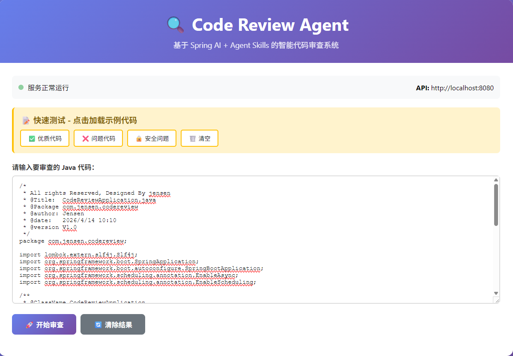
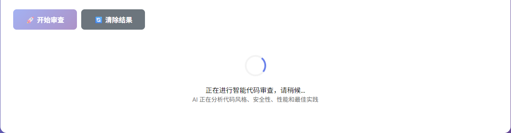
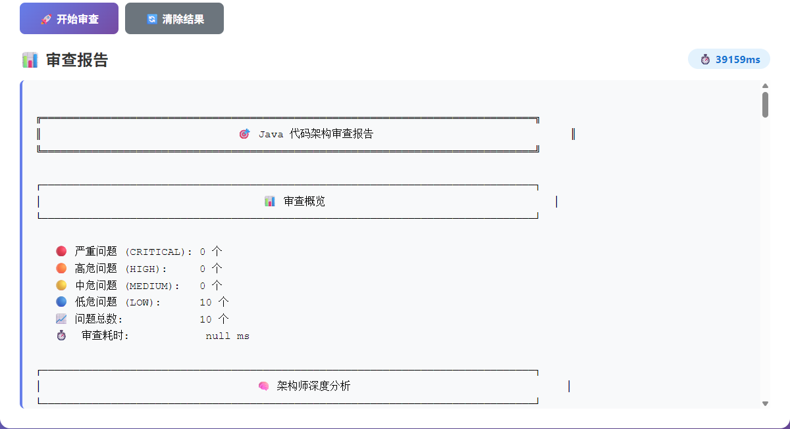

# Spring AI + Agent Skills 代码审查系统 v1.0

> 基于 Spring AI 和火山引擎 Coding Plan API 的智能代码审查系统，采用全 AI 驱动的 Skill 架构。

## 📋 目录

- [项目简介](#项目简介)
- [技术栈](#技术栈)
- [项目结构](#项目结构)
- [快速开始](#快速开始)
- [界面预览](#-界面预览)
- [核心架构](#核心架构)
- [AI Skills](#ai-skills)
- [API 接口](#api-接口)
- [配置说明](#配置说明)
- [测试](#测试)

---

## 项目简介

这是一个基于 **Spring AI** 和 **Agent Skills** 架构的智能代码审查系统。系统采用**全 AI 驱动**的设计理念，通过 7 个专业化的 AI Skills 对 Java 代码进行深度分析，生成架构师级别的专业审查报告。

### 核心特性

✅ **全 AI 驱动** - 所有 Skills 均使用 AI 进行深度语义分析  
✅ **7 个专业 Skills** - 覆盖安全、Bug、性能、风格、复杂度、最佳实践、文档  
✅ **统一基类设计** - BaseAISkill 提供标准化的 AI 调用能力  
✅ **智能编排** - SkillOrchestrator 按优先级并行执行 Skills  
✅ **专业报告** - 架构师级别的深度分析和改进建议  
✅ **异步执行** - CompletableFuture 提升响应速度  

---

## 技术栈

| 技术 | 版本              | 说明 |
|------|-----------------|------|
| Java | 21              | 运行时环境 |
| Spring Boot | 3.4.0           | 应用框架 |
| Spring AI | 1.0.0           | AI 集成框架 |
| Gradle | 9.2.0           | 构建工具 |
| Lombok | latest          | 代码简化 |
| 火山引擎 | Coding Plan API | AI 模型服务 |

---

## 项目结构

```
code-review-agent-skills/
├── build.gradle                          # Gradle 构建配置
├── settings.gradle                       # Gradle 设置
├── gradle.properties                     # Gradle 属性（JVM 参数）
├── gradlew / gradlew.bat                 # Gradle Wrapper
├── README.md                             # 项目文档
├── .gitignore                            # Git 忽略配置
│
├── src/
│   ├── main/
│   │   ├── java/com/jensen/codereview/
│   │   │   │
│   │   │   ├── CodeReviewApplication.java          # 主启动类
│   │   │   │
│   │   │   ├── agent/                               # AI 代理层
│   │   │   │   ├── AgentConfig.java                # AI 代理配置（ChatClient Bean）
│   │   │   │   └── CodeReviewAgent.java            # 代码审查代理（核心协调器）
│   │   │   │
│   │   │   ├── config/                              # 配置层
│   │   │   │   ├── AsyncSchedulingConfig.java      # 异步调度配置
│   │   │   │   ├── SkillAutoConfig.java            # Skill 自动注册配置
│   │   │   │   ├── ThreadPoolConfig.java           # 线程池配置
│   │   │   │   └── WebConfig.java                  # Web 配置（CORS）
│   │   │   │
│   │   │   ├── controller/                          # 控制层
│   │   │   │   ├── HealthController.java           # 健康检查接口
│   │   │   │   └── ReviewController.java           # 代码审查接口
│   │   │   │
│   │   │   ├── skill/                               # Skill 核心层
│   │   │   │   ├── base/                           # 基础抽象
│   │   │   │   │   ├── BaseAISkill.java            # ⭐ AI Skill 基类（核心）
│   │   │   │   │   ├── Skill.java                  # Skill 接口
│   │   │   │   │   ├── SkillContext.java           # Skill 上下文
│   │   │   │   │   └── SkillResult.java            # Skill 结果
│   │   │   │   │
│   │   │   │   ├── registry/                       # 注册中心
│   │   │   │   │   └── SkillRegistry.java          # Skill 注册器
│   │   │   │   │
│   │   │   │   ├── orchestrator/                   # 编排器
│   │   │   │   │   └── SkillOrchestrator.java      # Skill 编排器
│   │   │   │   │
│   │   │   │   └── impl/                           # 7 个 AI Skills
│   │   │   │       ├── SecuritySkill.java          # 🔒 安全漏洞扫描
│   │   │   │       ├── BugDetectionSkill.java      # 🐛 Bug 检测
│   │   │   │       ├── CodeStyleSkill.java         # 🎨 代码风格检查
│   │   │   │       ├── ComplexitySkill.java        # 📊 复杂度分析
│   │   │   │       ├── BestPracticeSkill.java      # ✨ 最佳实践检查
│   │   │   │       ├── PerformanceSkill.java       # ⚡ 性能分析
│   │   │   │       └── DocumentationSkill.java     # 📝 文档检查
│   │   │   │
│   │   │   ├── exception/                           # 异常处理
│   │   │   │   ├── GlobalExceptionHandler.java     # 全局异常处理器
│   │   │   │   ├── ReviewException.java            # 审查异常
│   │   │   │   └── SkillExecutionException.java    # Skill 执行异常
│   │   │   │
│   │   │   └── utils/                               # 工具类
│   │   │       ├── CodeParser.java                 # 代码解析器
│   │   │       ├── FileUtils.java                  # 文件工具
│   │   │       ├── JsonUtils.java                  # JSON 工具
│   │   │       └── MetricsCollector.java           # 指标收集器
│   │   │
│   │   └── resources/
│   │       ├── application.yml                     # 主配置文件
│   │       ├── logback-spring.xml                  # 日志配置
│   │       ├── rules/                              # 规则配置（预留）
│   │       ├── static/                             # 静态资源
│   │       │   └── index.html                      # 测试页面
│   │       └── templates/                          # 模板文件（预留）
│   │
│   └── test/
│       └── java/com/jensen/codereview/
│           ├── CodeReviewApplicationTests.java     # 应用启动测试
│           └── skill/base/
│               ├── SkillResultTest.java            # SkillResult 单元测试
│               └── SkillContextTest.java           # SkillContext 单元测试
│
└── src/test/java/com/jensen/codereview/
    └── CodeReview.http                             # HTTP API 测试文件
```

---

## 快速开始

### 1. 环境要求

- JDK 21+
- Gradle 9.2.0+
- 火山引擎 API Key

### 2. 配置火山引擎

编辑 `src/main/resources/application.yml`：

```yaml
spring:
  ai:
    openai:
      api-key: ${VOLCENGINE_API_KEY:your-api-key-here}
      base-url: https://ark.cn-beijing.volces.com/api
      completions-path: /coding/v3/chat/completions
      chat:
        options:
          model: ark-code-latest
```

### 3. 启动应用

```bash
# Windows
gradlew.bat bootRun

# Linux/Mac
./gradlew bootRun
```

启动成功后访问：
- 测试页面：http://localhost:8080/index.html
- 健康检查：http://localhost:8080/api/review/health

### 4. 测试 API

使用 `CodeReview.http` 文件（IDEA 内置 HTTP Client）或 curl：

```bash
curl -X POST http://localhost:8080/api/review/code \
  -H "Content-Type: application/json" \
  -d '{
    "code": "public class Test { public void method() {} }",
    "fileName": "Test.java"
  }'
```

---

## 📸 界面预览

### 开始审查



*提交代码后，系统显示加载状态*

### 加载中



*AI Skills 并行执行中...*

### 审查结果



*生成架构师级别的专业审查报告*

---

## 核心架构

### 架构图

```
用户请求 (HTTP)
    ↓
ReviewController
    ↓
CodeReviewAgent (核心协调器)
    ├─ 1. 创建 SkillContext
    ├─ 2. 调用 SkillOrchestrator
    │       ↓
    │   SkillOrchestrator
    │       ├─ 从 SkillRegistry 获取所有 Skills
    │       ├─ 按优先级排序
    │       └─ 并行执行 (CompletableFuture)
    │           ↓
    │       7 个 AI Skills (继承 BaseAISkill)
    │           ├─ SecuritySkill (P5)
    │           ├─ BugDetectionSkill (P8)
    │           ├─ CodeStyleSkill (P10)
    │           ├─ ComplexitySkill (P12)
    │           ├─ BestPracticeSkill (P15)
    │           ├─ PerformanceSkill (P20)
    │           └─ DocumentationSkill (P25)
    │               ↓
    │           BaseAISkill.analyzeWithAI()
    │               ├─ 构建 Prompt
    │               ├─ 调用 ChatClient
    │               ├─ 火山引擎 API
    │               └─ 解析 JSON 结果
    │
    ├─ 3. 合并所有 Issues（去重、排序）
    ├─ 4. AI 生成总结报告
    │       ├─ 阅读原始代码
    │       ├─ 分析所有 Skills 结果
    │       ├─ 生成架构师级报告
    │       └─ 提供分阶段改进建议
    └─ 5. 返回最终报告
```

### 关键组件说明

#### 1. BaseAISkill（核心基类）

所有 AI Skills 的抽象基类，提供统一的 AI 调用能力：

```java
public abstract class BaseAISkill implements Skill {
    protected final ChatClient chatClient;
    
    // 通用 AI 分析方法
    protected List<SkillResult.Issue> analyzeWithAI(String code);
    
    // 解析 AI 返回的 JSON
    protected List<SkillResult.Issue> parseAIResponse(String jsonResponse);
    
    // 构建标准结果
    protected SkillResult buildResult(List<Issue> issues, long startTime);
    
    // 子类必须实现
    protected abstract String getAIPrompt(String code);
    protected abstract String getCategory();
}
```

**优势：**
- ✅ 统一的错误处理和降级机制
- ✅ 标准化的 JSON 解析
- ✅ 代码截断策略（3000 字符限制）
- ✅ 子类只需关注 Prompt 设计

#### 2. CodeReviewAgent（核心协调器）

负责协调整个审查流程：

```java
public class CodeReviewAgent {
    private final SkillOrchestrator orchestrator;
    private final ChatClient chatClient;
    
    // 执行完整审查流程
    public SkillResult review(SkillContext context);
    
    // 合并多个 Skill 的结果
    public static List<Issue> mergeResults(List<SkillResult> results);
    
    // AI 生成总结报告
    private String generateAISummary(String code, SkillResult result);
    
    // 智能问题分类汇总
    private String buildSmartIssueSummary(List<Issue> issues);
}
```

**核心功能：**
- 协调 Skill 执行
- 合并和去重 Issues
- AI 生成架构师级报告
- 智能分类展示问题（CRITICAL/HIGH 详细，MEDIUM/LOW 统计）

#### 3. SkillOrchestrator（技能编排器）

负责 Skills 的调度和执行：

```java
public class SkillOrchestrator {
    private final SkillRegistry registry;
    
    // 按优先级并行执行所有 Skills
    public List<SkillResult> executeAll(SkillContext context);
}
```

**执行策略：**
- 从 SkillRegistry 获取所有 Skills
- 按优先级排序（数字越小越优先）
- 使用 `CompletableFuture.supplyAsync()` 并行执行
- 等待所有 Skills 完成并返回结果

---

## AI Skills

系统包含 7 个专业 AI Skills，每个 Skill 都继承 `BaseAISkill`，专注于特定领域的深度分析。

### Skills 列表

| Skill | 优先级 | 类别 | 检查维度 |
|-------|--------|------|----------|
| **SecuritySkill** | 5 | SECURITY | SQL注入、XSS、硬编码凭证、路径遍历、敏感信息泄露等 10 个维度 |
| **BugDetectionSkill** | 8 | BUG | 空指针、资源泄漏、并发问题、异常处理、边界条件等 12 个维度 |
| **CodeStyleSkill** | 10 | STYLE | 命名规范、代码格式、注释风格、方法长度等 7 个维度 |
| **ComplexitySkill** | 12 | COMPLEXITY | 圈复杂度、嵌套深度、方法长度、参数数量、类职责等 12 个维度 |
| **BestPracticeSkill** | 15 | BEST_PRACTICE | 设计模式、SOLID原则、不可变性、接口编程、Lambda使用等 12 个维度 |
| **PerformanceSkill** | 20 | PERFORMANCE | 字符串拼接、集合初始化、N+1查询、缓存使用、算法复杂度等 12 个维度 |
| **DocumentationSkill** | 25 | DOCUMENTATION | JavaDoc、注释质量、TODO标记、魔法数字、复杂逻辑等 12 个维度 |

### Skill 示例：SecuritySkill

```java
@Component
public class SecuritySkill extends BaseAISkill {
    
    public SecuritySkill(ChatClient chatClient) {
        super(chatClient);
    }
    
    @Override
    protected String getAIPrompt(String code) {
        return """
            你是一位资深的安全专家。请分析以下代码的安全漏洞：
            
            ```java
            %s
            ```
            
            请从以下维度检查安全问题：
            1. SQL注入：是否使用字符串拼接构建SQL语句
            2. XSS攻击：是否有未转义的用户输入输出
            3. 硬编码凭证：密码、密钥、Token是否硬编码在代码中
            4. 路径遍历：文件操作是否有路径验证
            5. 敏感信息泄露：日志中是否打印敏感信息
            6. 不安全的随机数：是否使用SecureRandom
            7. 反序列化漏洞：是否有不安全的反序列化操作
            8. 权限控制：是否有缺失的权限校验
            9. 加密算法：是否使用了不安全的加密算法（如MD5、SHA1）
            10. 资源泄漏：数据库连接、IO流是否正确关闭
            
            severity 可选值：CRITICAL/HIGH/MEDIUM/LOW
            只返回 JSON 数组，不要其他内容。
            """.formatted(codeSnippet);
    }
    
    @Override
    protected String getCategory() {
        return "SECURITY";
    }
}
```

### 添加新 Skill

只需 3 步：

```java
// 1. 创建 Skill 类
@Component
public class MyCustomSkill extends BaseAISkill {
    
    public MyCustomSkill(ChatClient chatClient) {
        super(chatClient);
    }
    
    @Override
    protected String getAIPrompt(String code) {
        // 定义专业的检查维度和 Prompt
        return "...";
    }
    
    @Override
    protected String getCategory() {
        return "MY_CATEGORY";
    }
    
    @Override
    public int getPriority() {
        return 30; // 设置优先级
    }
}

// 2. Spring 自动注册（无需额外配置）

// 3. 自动被 SkillOrchestrator 发现和执行
```

---

## API 接口

### 1. 健康检查

```http
GET /api/review/health
```

**响应：**
```json
{
  "status": "UP",
  "timestamp": "2026-04-14T10:00:00Z"
}
```

### 2. 获取 API 信息

```http
GET /api/review
```

**响应：**
```json
{
  "name": "Code Review Agent with Skills",
  "version": "1.0.0",
  "description": "基于 Spring AI 的智能代码审查系统",
  "skills": ["SecuritySkill", "BugDetectionSkill", ...]
}
```

### 3. 测试 AI 连接

```http
GET /api/review/test-ai
```

**响应：**
```json
{
  "success": true,
  "message": "AI 服务连接正常"
}
```

### 4. 代码审查（核心接口）

```http
POST /api/review/code
Content-Type: application/json

{
  "code": "public class UserService { ... }",
  "fileName": "UserService.java"
}
```

**响应：**
```json
{
  "skillName": "Code Review Agent",
  "success": true,
  "summary": "总体评价：代码质量良好，但存在 3 个需要优化的问题...",
  "issues": [
    {
      "severity": "CRITICAL",
      "category": "SECURITY",
      "lineNumber": 15,
      "description": "SQL注入风险：使用字符串拼接构建SQL",
      "fixSuggestion": "使用 PreparedStatement 或 ORM 框架",
      "codeSnippet": "String sql = \"SELECT * FROM users WHERE name='\" + input + \"'\""
    }
  ],
  "suggestions": [
    {
      "title": "立即修复",
      "description": "修复 SQL 注入漏洞",
      "priority": "HIGH"
    }
  ],
  "metrics": {
    "totalIssues": 5,
    "criticalCount": 1,
    "highCount": 2,
    "mediumCount": 2,
    "executionTimeMs": 3500
  },
  "executionTimeMs": 3500
}
```

---

## 配置说明

### application.yml

```yaml
server:
  port: 8080

spring:
  application:
    name: code-review-agent-skills
  
  ai:
    openai:
      api-key: ${VOLCENGINE_API_KEY:your-api-key-here}
      base-url: https://ark.cn-beijing.volces.com/api
      completions-path: /coding/v3/chat/completions
      chat:
        options:
          model: ark-code-latest
          temperature: 0.2
          max-tokens: 4000

logging:
  level:
    com.jensen.codereview: INFO
    org.springframework.ai: WARN
```

### 关键配置项

| 配置项 | 说明 | 默认值 |
|--------|------|--------|
| `spring.ai.openai.api-key` | 火山引擎 API Key | - |
| `spring.ai.openai.base-url` | API 基础 URL | 火山引擎端点 |
| `spring.ai.openai.completions-path` | 补全路径 | `/coding/v3/chat/completions` |
| `spring.ai.openai.chat.options.model` | 模型名称 | `ark-code-latest` |
| `spring.ai.openai.chat.options.temperature` | 温度参数 | 0.2 |
| `spring.ai.openai.chat.options.max-tokens` | 最大 Token 数 | 4000 |

---

## 测试

### 1. HTTP API 测试

使用 IDEA 内置 HTTP Client 打开 `src/test/java/com/jensen/codereview/CodeReview.http`，包含：

- ✅ 健康检查测试
- ✅ AI 连接测试
- ✅ 优质代码审查示例
- ✅ 问题代码审查示例
- ✅ 安全漏洞代码示例
- ✅ 性能问题代码示例
- ✅ 高复杂度代码示例
- ✅ 文档缺失代码示例
- ✅ 边界情况测试

### 3. Web 界面测试

访问 http://localhost:8080/index.html，提供友好的测试界面。

---

## 设计模式

| 模式 | 应用场景 | 说明 |
|------|---------|------|
| **策略模式** | 不同 Skills 实现不同的检查策略 | 每个 Skill 是一个独立的策略 |
| **模板方法模式** | BaseAISkill 定义执行模板 | 子类只需实现 getAIPrompt() 和 getCategory() |
| **注册表模式** | SkillRegistry 管理所有 Skills | Spring 自动注入所有 Skill 实现 |
| **工厂模式** | Spring IoC 容器 | 替代传统工厂，自动管理 Bean 生命周期 |
| **观察者模式** | CompletableFuture 异步通知 | 异步执行完成后自动聚合结果 |

---

## 扩展指南

### 1. 添加新的 AI Skill

参考 [AI Skills](#ai-skills) 章节的示例。

### 2. 调整 Skill 优先级

修改 `getPriority()` 方法的返回值（数字越小越优先）。

### 3. 优化 AI Prompt

在每个 Skill 的 `getAIPrompt()` 方法中调整提示词，增加或减少检查维度。

### 4. 自定义报告格式

修改 `CodeReviewAgent.generateAISummary()` 方法中的 Prompt。

### 5. 切换 AI 提供商

修改 `application.yml` 中的 `base-url` 和 `completions-path` 配置。

---

## 常见问题

### Q1: 如何获取火山引擎 API Key？

访问 [火山引擎官网](https://www.volcengine.com/) 注册账号，在控制台创建 API Key。

### Q2: API 调用失败怎么办？

1. 检查 API Key 是否正确
2. 检查网络连接
3. 查看日志：`logs/code-review.log`
4. 访问 `/api/review/test-ai` 测试连接

### Q3: 如何减少 Token 消耗？

当前版本已实施以下优化：
- 代码截断：超过 3000 字符自动截断
- Temperature 设置为 0.2（降低随机性）
- 移除冗余的 AICodeQualitySkill

### Q4: 如何提升响应速度？

- Skills 已采用并行执行（CompletableFuture）
- 可考虑添加缓存（未来版本）
- 可减少 max-tokens 配置

---

## 版本历史

### v1.0.0 (2026-04-14)

✅ **核心功能**
- 完整的 AI 驱动 Skill 架构
- 7 个专业 AI Skills
- BaseAISkill 统一基类
- 智能编排和并行执行
- 架构师级报告生成

✅ **技术特性**
- Spring AI 1.0.0 集成
- 火山引擎 Coding Plan API
- CompletableFuture 异步执行
- 统一的错误处理和降级

✅ **开发体验**
- 完善的 HTTP 测试用例
- Web 测试界面
- 详细的 API 文档
- 清晰的代码结构

---

## 许可证

Copyright © 2026 Jensen. All rights reserved.

---

## 联系方式

- Author: Jensen
- Email: zoujie0519@163.com
- Project: Code Review Agent with Skills

---

**🎉 感谢使用！如有问题欢迎提交 Issue 或 PR。**
